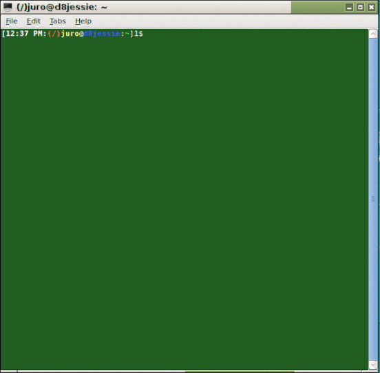

## Creating Animated GIFs

Animated GIFs, such as the one given below are easy to create.  Among the possibilities are using `gifsicle` from [Gifsicle](https://www.lcdf.org/gifsicle/) and `convert` from [ImageMagick](https://www.imagemagick.org/)

### Using `gifsicle`
From [Gifsicle](https://www.lcdf.org/gifsicle/man.html):

- put all the GIF images, appropriately named so that they fall in the correct order of appearance when listed/sorted alphabetically (sometimes tricky), in one folder/directory
- `cd` (change into) the directory containing the GIF images then issue the following command to create the animated GIF `all.gif`:
```bash
gifsicle --colors 256 -d 100 *.gif > all.gif
```

### Using `convert`
From [ImageMagick](https://www.imagemagick.org/Usage/anim_basics/): 

- put all the PNG (or GIF) images, appropriately named so that they fall in the correct order of appearance when listed/sorted alphabetically (sometimes tricky), in one folder/directory
- `cd` (change into) the directory containing the PNG (or GIF) images then issue the following command (for PNGs) to create the animated GIF `all.gif`:
```bash
convert -d 100 *.png all.gif  
```

### Notes
- For `gifsicle` (am not sure if also true for `convert`), the `-d 100` option causes a delay of 1 second (=100 \* 1/100th of a second) between frames, i.e., `d -250` causes a 2 1/2 s delay, `-d 325` causes a 3 1/4 s delay.
- `mogrify` - from ImageMagick can be used to convert PNGs to GIFs (and vice-versa):
```bash
mogrify -format gif *.png
```
- `display` - from ImageMagick gives a GUI that allows one to examine, study, edit, save changes made to an existing image, e.g., change the speed fo animated GIFs.

## Example
The screenshot (partly edited) of a [`t3C` tic-tac-toe game](https://github.com/justineuro/tic-tac-toe) session given below was created using `gifsicle` and the images in the [images-gif](./images-gif) folder. 


## License
<a rel="license" href="http://creativecommons.org/licenses/by/4.0/"></a><br /><span xmlns:dct="http://purl.org/dc/terms/" property="dct:title"><b>animatedGIFs</b></span> by <a xmlns:cc="http://creativecommons.org/ns#" href="https://github.com/justineuro/" property="cc:attributionName" rel="cc:attributionURL">Justine Leon A. Uro</a> is licensed under a <a rel="license" href="http://creativecommons.org/licenses/by/4.0/">Creative Commons Attribution 4.0 International License</a>.<br />Based on a work at <a xmlns:dct="http://purl.org/dc/terms/" href="https://github.com/justineuro/mdginabc2svg" rel="dct:source">https://github.com/justineuro/animatedGIFs</a>